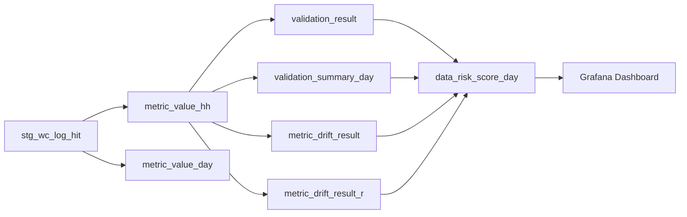

# Data Lineage MVP

## 설명
- `stg_wc_log_hit`: raw/staging log source
- `metric_value_hh`, `metric_value_day`: semantic metric layer
- `validation_*`: logical consistency checks
- `metric_drift_result*`: statistical anomaly signals
- `data_risk_score_day`: operational control metric
- `Grafana`: observability surface
