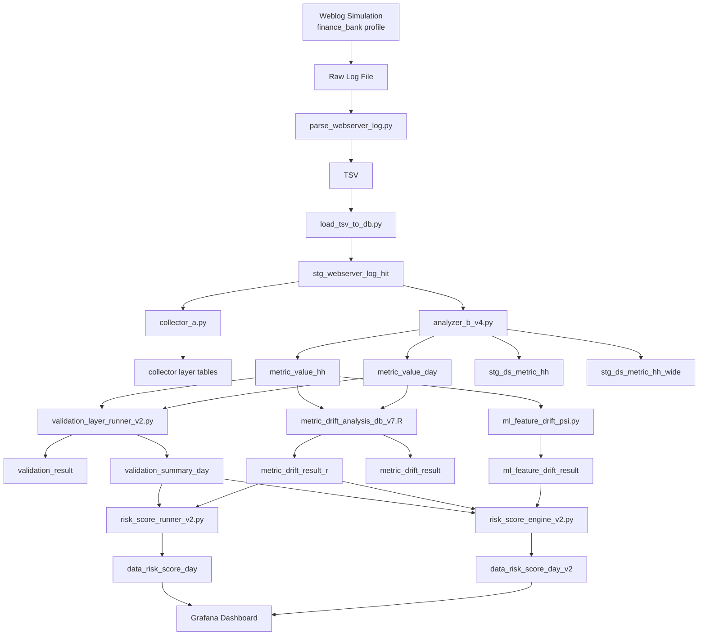
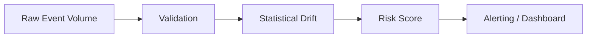
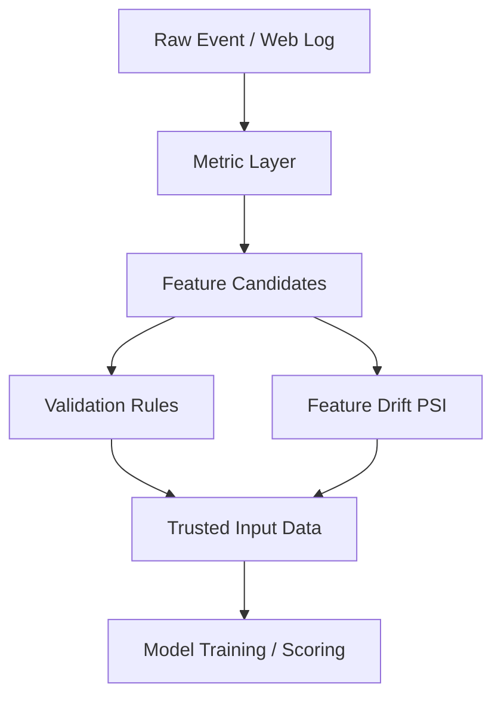

# Data Reliability Architecture

## End-to-End System

```mermaid
flowchart TD
    A[Weblog Simulation\nfinance_bank profile] --> B[Raw Log File]
    B --> C[parse_webserver_log.py]
    C --> D[TSV]
    D --> E[load_tsv_to_db.py]
    E --> F[stg_webserver_log_hit]

    F --> G[collector_a.py]
    G --> H[collector layer tables]

    F --> I[analyzer_b_v4.py]
    I --> J[metric_value_hh]
    I --> K[metric_value_day]
    I --> L[stg_ds_metric_hh]
    I --> M[stg_ds_metric_hh_wide]

    J --> N[validation_layer_runner_v2.py]
    K --> N
    N --> O[validation_result]
    N --> P[validation_summary_day]

    J --> Q[metric_drift_analysis_db_v7.R]
    K --> Q
    Q --> R[metric_drift_result_r]
    Q --> S[metric_drift_result]

    J --> T[ml_feature_drift_psi.py]
    T --> U[ml_feature_drift_result]

    P --> V[risk_score_runner_v2.py]
    R --> V
    V --> W[data_risk_score_day]

    P --> X[risk_score_engine_v2.py]
    R --> X
    U --> X
    X --> Y[data_risk_score_day_v2]

    W --> Z[Grafana Dashboard]
    Y --> Z
```

## Control Flow

```mermaid
flowchart LR
    A[Raw Event Volume] --> B[Validation]
    B --> C[Statistical Drift]
    C --> D[Risk Score]
    D --> E[Alerting / Dashboard]
```

## ML Input Reliability View

```mermaid
flowchart TD
    A[Raw Event / Web Log] --> B[Metric Layer]
    B --> C[Feature Candidates]
    C --> D[Validation Rules]
    C --> E[Feature Drift PSI]
    D --> F[Trusted Input Data]
    E --> F
    F --> G[Model Training / Scoring]
```
