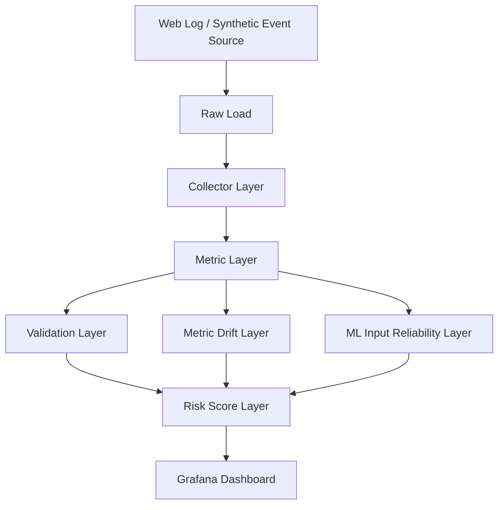

# ML Input Reliability 정리안

## 결론
9-1과 9-2는 목적이 비슷하지만, **9-2를 표준안으로 채택**하는 것이 맞습니다.

### 이유
- 9-2는 `baseline-days`를 명시적으로 제어할 수 있습니다.
- 9-2는 `weekday + hour` baseline 설명과 구현이 더 선명합니다.
- 9-2는 `risk_score_runner_v3.py`까지 연결되어 **ML Data Reliability Platform** 서사가 더 좋습니다.
- 9-1은 MVP/초기 버전으로 남기고, 운영/포트폴리오 기준은 9-2를 쓰는 편이 좋습니다.

## 9-1 vs 9-2 정리

### 9-1
- `ml_feature_drift_psi.py`
- `risk_score_engine_v2.py`

역할:
- ML input reliability의 초기 MVP
- 간단한 PSI-like drift
- validation + drift + ml_feature_drift를 합친 risk score v2

권장 포지션:
- **legacy / MVP 버전**
- 문서에는 "initial ML input reliability experiment" 정도로 남기기

### 9-2
- `ml_feature_drift_analyzer.py`
- `risk_score_runner_v3.py`
- `grafana_ml_feature_reliability_dashboard.json`
- `grafana_ml_feature_reliability_queries.sql`

역할:
- ML input reliability 정식 버전
- hourly feature drift + risk v3
- Grafana ML dashboard와 직접 연결

권장 포지션:
- **표준안 / main path**
- 이후 확장은 9-2 기준으로 진행

## 전체 아키텍처에서 9-2 위치



### 해석
- `ml_feature_drift_analyzer.py` 는 **Metric Layer 이후**
- `risk_score_runner_v3.py` 는 **Validation + Drift + ML Input Reliability를 합치는 Risk Layer**
- 즉 ML 관련 로직은 **별도 ml 폴더로 분리**하는 것이 적절합니다.

## 추천 프로젝트 구조

```text
financial-data-reliability-platform/
├── pipelines/
│   ├── parse_webserver_log.py
│   ├── load_tsv_to_db_v2.py
│   ├── collector_a_v2.py
│   ├── analyzer_b_v4.py
│   ├── validation_layer_runner_v2.py
│   ├── risk_score_runner_v2.py
│
├── r/
│   └── metric_drift_analysis_db_v7.R
│
├── ml/
│   ├── ml_feature_drift_analyzer.py
│   ├── risk_score_runner_v3.py
│   ├── ml_feature_vector_builder.py
│   ├── ml_risk_model_train.py
│   └── ml_prediction_runner.py
│
├── dashboards/
│   ├── grafana_financial_data_risk_dashboard.json
│   ├── grafana_ml_feature_reliability_dashboard.json
│   └── grafana_ml_feature_reliability_queries.sql
│
├── deploy/
│   ├── run_backfill_pipeline.sh
│   ├── run_daily_pipeline.sh
│   ├── run_ml_backfill.sh
│   └── run_ml_daily.sh
│
└── docs/
    └── ml_input_reliability.md
```

## Grafana 대시보드 운영 원칙

### 권장
- **별도 dashboard 분리**
  - `grafana_financial_data_risk_dashboard.json`
  - `grafana_ml_feature_reliability_dashboard.json`

### 이유
- 기존 dashboard는 data reliability 중심
- ML dashboard는 feature drift / risk v3 / prediction 중심
- 한 화면에 다 넣으면 오히려 목적이 흐려짐

### 추천 운영
- 운영 모니터링: 기존 dashboard
- 포트폴리오 / 확장 시연: ML dashboard

## 백필 스크립트 보완 방향

현재 업로드된 `run_backfill_pipeline.sh`는 validation/drift/risk(v2)까지는 잘 연결되어 있습니다. fileciteturn0file0

하지만 9-2 표준안 기준으로는 아래가 추가되어야 합니다.

### 추가 필요 단계
1. `ml_feature_drift_analyzer.py`
2. `risk_score_runner_v3.py`
3. 선택적으로
   - `ml_feature_vector_builder.py`
   - `ml_prediction_runner.py`

즉 백필 흐름은 아래처럼 가는 것이 맞습니다.

```text
simulation
→ parse/load
→ collector
→ analyzer
→ validation
→ drift
→ risk v2
→ ml feature drift
→ risk v3
→ (optional) ml prediction
```

## 권장 운영 기준

### 표준 실행 계층
- **Data Reliability**:
  - analyzer
  - validation
  - drift
  - risk v2

- **ML Data Reliability**:
  - ml_feature_drift_analyzer
  - risk v3
  - ML dashboard

### ML 모델은 아직 optional
- 지금 당장은 **ML input reliability까지**를 1차 목표로 두는 것이 가장 좋습니다.
- 예측 모델은 그 다음 단계로 두는 것이 포트폴리오 메시지가 더 선명합니다.
