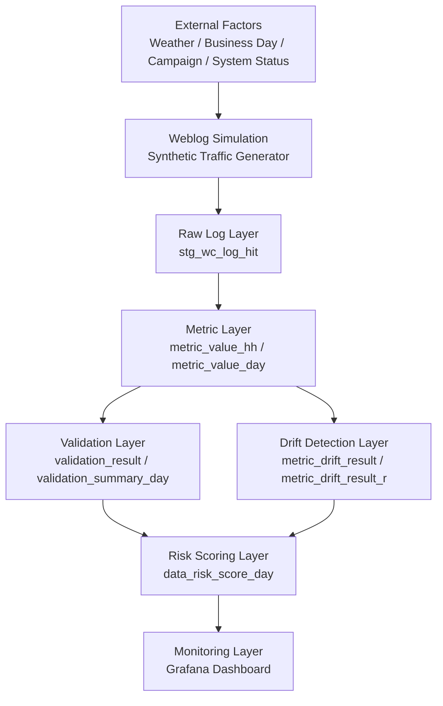

# Financial Data Reliability Platform 아키텍처

## 한 줄 소개

금융 디지털 채널의 웹로그를 대상으로, **지표 생성 → 데이터 검증 → Drift 탐지 → Risk Scoring → 모니터링**까지 연결한 **Data Reliability Architecture**를 설계하고 구현한 프로젝트입니다.

---

## 왜 이 프로젝트를 만들었는가

운영 지표는 단순히 계산만 된다고 끝나지 않습니다.  
특히 금융 서비스에서는 다음 문제가 실제 운영 리스크로 이어질 수 있습니다.

- 이벤트 누락으로 KPI가 잘못 집계되는 문제
- 인증/신청 Funnel이 비정상적으로 보이지만 실제로는 매핑 오류인 문제
- 트래픽 분포가 변했는데 배치 결과만 보고는 이상을 빨리 감지하지 못하는 문제
- 데이터 품질 이슈가 운영 대시보드에 반영되지 않아 사후 대응만 하게 되는 문제

이 프로젝트는 이런 문제를 해결하기 위해, 웹로그 기반 운영 지표를 **신뢰 가능한 데이터 제품**으로 만들기 위한 통제 구조를 목표로 했습니다.

---

## 전체 아키텍처



---

## 레이어별 역할

### 1. Synthetic Event Source Layer
웹로그 시뮬레이터는 단순 랜덤 로그 생성기가 아니라, **외생 변수(exogenous variables)** 를 반영해 금융 서비스 트래픽을 흉내냅니다.

반영 요소 예시:

- 날씨
- 업무일 / 휴일
- 캠페인
- 시스템 상태

즉, 시뮬레이터는 포트폴리오용 더미 데이터 생성기가 아니라, **관측 가능한 이상 패턴을 만들 수 있는 실험 환경**입니다.

---

### 2. Raw Log Layer
원천 웹로그를 `stg_wc_log_hit`에 적재합니다.

핵심 처리:

- URL normalization
- uid 추출
- kv_raw 원문 보존
- 분석 전 staging 표준화

이 레이어는 “raw but usable” 성격의 소스 레이어입니다.

---

### 3. Metric Layer
웹로그를 시간 단위/일 단위 운영 지표로 변환합니다.

대표 테이블:

- `metric_value_hh`
- `metric_value_day`

대표 지표 그룹:

- user activity
- auth/security
- financial funnel
- system/control

즉, 이 레이어는 단순 로그가 아니라 **운영 가능한 semantic metric**을 만드는 역할을 합니다.

---

### 4. Validation Layer
Drift 분석 전에, 지표 자체가 논리적으로 맞는지 검증합니다.

대표 규칙:

- `raw_event_count >= collector_event_count`
- `collector_event_count >= page_view_count`
- `auth_success_count <= auth_attempt_count`
- `loan_apply_submit_count <= loan_apply_start_count`
- `ratio metric in [0, 1]`
- `hourly completeness`

대표 테이블:

- `validation_result`
- `validation_summary_day`

이 레이어의 핵심 메시지는 다음 한 문장으로 요약됩니다.

> Drift detection is only meaningful after ensuring metric validity.

---

### 5. Drift Detection Layer
Validation을 통과한 지표를 대상으로 baseline 대비 이상을 탐지합니다.

사용한 방법:

- Z-score
- PSI-like drift
- Funnel conversion change

핵심 설계 포인트:

- 단순 7일 평균이 아니라
- **weekday + hour baseline**을 사용해 운영 패턴을 반영

대표 테이블:

- `metric_drift_result`
- `metric_drift_result_r`

---

### 6. Risk Scoring Layer
Validation과 Drift 결과를 하나의 운영 리스크 점수로 통합합니다.

예시 수식:

```text
risk_score =
5 * validation_fail
+ 2 * validation_warn
+ 3 * drift_alert
+ 1 * drift_warn
```

대표 테이블:

- `data_risk_score_day`

즉, 이 레이어는 많은 품질 신호를 현업이 이해할 수 있는 **daily operational risk indicator**로 바꿉니다.

---

### 7. Monitoring Layer
Grafana를 통해 데이터 품질과 운영 리스크를 시각화합니다.

대표 패널:

- Risk Score
- Validation Summary
- Drift Alert / Warn
- Hourly Event Volume
- Auth Funnel
- Loan / Card Funnel

이 레이어까지 연결되면서, 이 프로젝트는 단순 분석이 아니라 **운영형 데이터 신뢰성 플랫폼**이 됩니다.

---

## 왜 이 아키텍처가 의미 있는가

이 프로젝트는 다음을 하나로 묶었습니다.

- synthetic event generation
- metric layer
- validation framework
- drift detection
- risk scoring
- observability

즉, “로그를 만들고 끝”이 아니라,  
**데이터를 신뢰할 수 있는 상태로 운영하는 구조**를 만들었다는 점이 핵심입니다.

---

## 기술 스택

- Python
- R
- MySQL / MariaDB
- Grafana
- YAML-based config
- WSL development environment
- macOS home server deployment target

---

## 프로젝트 포지셔닝

이 프로젝트는 단순 웹로그 분석 프로젝트가 아니라 아래 포지션에 더 가깝습니다.

- Data Engineer
- Data Platform Engineer
- Analytics Engineer
- Data Reliability Engineer

특히 포트폴리오 관점에서는 다음 키워드로 설명할 수 있습니다.

- Data Quality
- Observability
- Drift Detection
- Risk Control
- Monitoring Architecture
