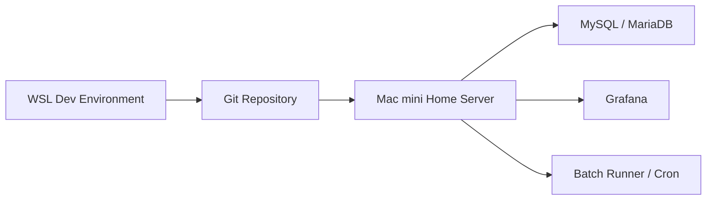

# 프로젝트 운영 구조 · 소스 관리 전략 · 향후 확장 판단

## 현재 개발/운영 환경

현재 작업 환경은 다음과 같습니다.

- **WSL**: 개발용
- **Mac mini 홈서버**: 배포 및 운영 실험용(구축 예정)

이 구조는 포트폴리오용으로도 충분히 의미가 있습니다.  
다만 저장소 구조는 “개발 소스”와 “운영 배포”를 구분해서 보이게 만드는 것이 좋습니다.

---

## 추천 소스 관리 구조

```text
financial-data-reliability-platform/
├── README.md
├── .gitignore
├── pyproject.toml
├── requirements.txt
├── requirements-r.txt
│
├── architecture/
│   ├── system_architecture.md
│   ├── pipeline_architecture.md
│   ├── validation_architecture.md
│   ├── drift_architecture.md
│   ├── risk_scoring_architecture.md
│   └── diagrams/
│       ├── system_architecture.mmd
│       ├── validation_flow.mmd
│       └── deployment_topology.mmd
│
├── configs/
│   ├── profiles/
│   └── format_meta_default.yaml
│
├── simulator/
│   └── weblog_sim/
│       ├── cli.py
│       ├── core/
│       └── meta/
│
├── pipelines/
│   ├── analyzer_b_v2.py
│   ├── validation_layer_runner_v4.py
│   ├── risk_score_runner_v2.py
│   └── db_utils.py
│
├── r/
│   └── metric_drift_analysis_db_v6.R
│
├── sql/
│   ├── 01_raw_tables.sql
│   ├── 02_metric_tables.sql
│   ├── 03_validation_tables.sql
│   ├── 04_drift_tables.sql
│   ├── 05_risk_tables.sql
│   └── 99_dashboard_queries.sql
│
├── dashboards/
│   └── grafana_financial_data_risk_dashboard.json
│
├── deploy/
│   ├── wsl/
│   │   ├── setup_dev.sh
│   │   └── run_local_pipeline.sh
│   └── mac-mini/
│       ├── setup_server.sh
│       ├── run_daily_pipeline.sh
│       └── grafana/
│           └── datasource_example.md
│
├── docs/
│   ├── project_overview.md
│   ├── metric_catalog.md
│   ├── validation_rules.md
│   ├── drift_methodology.md
│   ├── risk_scoring_model.md
│   ├── runbook.md
│   └── portfolio_story.md
│
├── sample_data/
│
└── tests/
```

이 구조의 장점은 다음과 같습니다.

- 블로그 문서와 코드 구조가 일관됨
- 개발 환경(WSL)과 운영 환경(Mac mini)을 분리해 설명 가능
- “실제 배포를 고려한 구조”라는 인상을 줌

---

## WSL / Mac mini 운영 토폴로지



### 역할 분리
- WSL: 코드 개발, 테스트, 샘플 실행
- Git: 버전 관리, 문서 중심 포트폴리오 정리
- Mac mini: 홈서버 기반 배포 실험, dashboard 운영, batch 실행

이 구조는 포트폴리오 관점에서 충분히 설득력 있습니다.

---

## 향후 확장 후보에 대한 판단

질문은 “이 커리어 방향에서 시간을 써도 되는가?” 입니다.  
결론은 아래와 같습니다.

### 우선순위 높음
1. Airflow orchestration
2. Alerting
3. Data lineage
4. Incident table

### 우선순위 낮음
5. ML anomaly model
6. Real-time streaming version

---

## 1. Airflow orchestration

### 커리어 적합성
**높음**

이유:
- 지금 파이프라인은 이미 배치 구조로 완성되어 있음
- CLI 실행만 DAG로 감싸도 “production-style orchestration”이 됨
- Data Engineer / Platform Engineer 포트폴리오에서 설명력이 큼

### MVP로 할 것
- 하루 1회 실행 DAG
- task 순서:
  - metric ETL
  - validation
  - drift
  - risk score

### 포트폴리오 메시지
```text
Converted CLI-based reliability jobs into an orchestrated batch workflow using Airflow.
```

---

## 2. Alerting (Grafana / Slack / Email)

### 커리어 적합성
**높음**

이유:
- 운영 통제 플랫폼의 완성도를 크게 올림
- Risk Score가 이미 있으므로 alert 조건이 명확함

### MVP로 할 것
- Grafana alert rule 1개
- 조건: `risk_score >= 6`
- 부가 조건:
  - validation_fail_count > 0
  - drift_alert_count > 0

Slack 연동까지는 선택이고, 포트폴리오 MVP는 **Grafana Alert Rule 문서화**만으로도 충분합니다.

---

## 3. Data Lineage

### 커리어 적합성
**높음**

이유:
- 이 프로젝트는 여러 레이어를 가지므로 lineage 설명이 아주 중요함
- 구현 비용이 작고 포트폴리오 효과가 큼

### MVP로 할 것
문서/다이어그램만 만들면 충분합니다.

```text
stg_wc_log_hit
→ metric_value_hh / metric_value_day
→ validation_result / validation_summary_day
→ metric_drift_result
→ data_risk_score_day
→ Grafana
```

즉, 이건 코드보다 문서가 더 중요합니다.

---

## 4. Incident Table

### 커리어 적합성
**중상**

이유:
- “탐지”에서 “대응”으로 넘어가는 구조를 만들 수 있음
- 운영 관점 서사가 강해짐

### MVP로 할 것
테이블 1개면 충분합니다.

예시:

```sql
CREATE TABLE data_incident (
  incident_id BIGINT UNSIGNED NOT NULL AUTO_INCREMENT PRIMARY KEY,
  profile_id VARCHAR(50) NOT NULL,
  dt DATE NOT NULL,
  incident_type VARCHAR(50) NOT NULL,
  metric_name VARCHAR(100) NULL,
  severity VARCHAR(20) NOT NULL,
  status VARCHAR(20) NOT NULL DEFAULT 'open',
  detected_at DATETIME NOT NULL DEFAULT CURRENT_TIMESTAMP,
  resolved_at DATETIME NULL,
  note VARCHAR(255) NULL
);
```

그리고 기준:
- risk_score >= 6 이면 incident candidate
- drift_status = alert 이면 incident candidate

이 정도면 충분합니다.

---

## 5. ML anomaly model

### 커리어 적합성
**지금은 낮음**

이유:
- 현재 프로젝트는 이미 rule + statistics로 충분히 설득력 있음
- ML을 넣으면 복잡도는 크게 늘지만, 오히려 핵심 메시지가 흐려질 수 있음
- IsolationForest / Prophet은 “있으면 멋있지만 필수는 아님”

### 판단
지금 단계에서는 **문서에 future work로만 남기는 것**을 추천합니다.

---

## 6. Real-time streaming version

### 커리어 적합성
**지금은 낮음**

이유:
- 현재 프로젝트는 batch reliability architecture로 완결성이 있음
- 스트리밍까지 가면 Kafka / Spark / Flink 등 아예 다른 문제로 커짐
- 포트폴리오 범위를 지나치게 넓힘

### 판단
지금은 하지 않는 게 낫습니다.

---

## 최종 추천 우선순위

### 반드시 하면 좋은 것
1. Data lineage diagram
2. Airflow DAG 문서 + MVP 코드
3. Grafana alert rule 문서
4. Incident table DDL + 간단한 등록 기준

### 나중에 해도 되는 것
5. Slack alerting
6. ML anomaly detection
7. Real-time streaming

---

## 포트폴리오용 최종 메시지

이 프로젝트는 단순 시뮬레이터나 단순 대시보드가 아니라, 다음을 포함한 end-to-end architecture 입니다.

- synthetic log generation
- metric engineering
- validation framework
- statistical drift detection
- operational risk scoring
- observability dashboard

즉, 이 프로젝트의 핵심은 코드량보다 **아키텍처 사고와 운영 관점 설계**에 있습니다.
