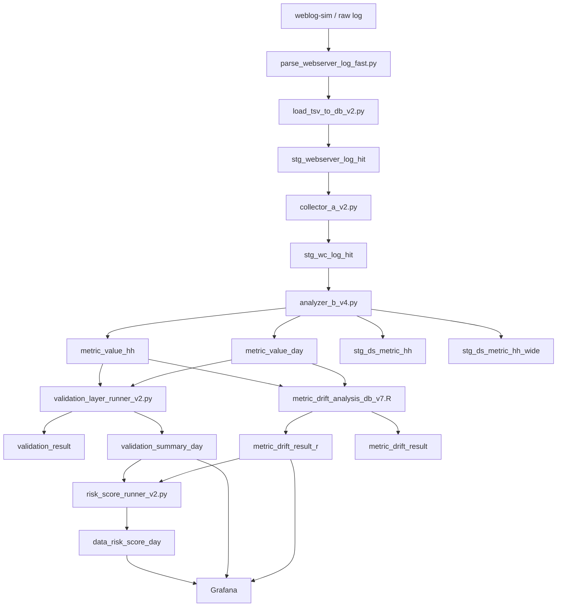

# Analyzer + Validation + Drift + Risk 전체 파이프라인 구조 정리

## End-to-End Batch Pipeline

## 핵심 체크 포인트

### Analyzer
- `metric_value_hh` 날짜별 row count
- `collector_event_count >= page_view_count`
- `raw_event_count >= collector_event_count`

### Validation
- fail count
- warn count
- mapping quality rules

### Drift
- warn/alert count by date
- high drift metrics by hour

### Risk
- 일별 risk_score
- warn/alert 전환일
